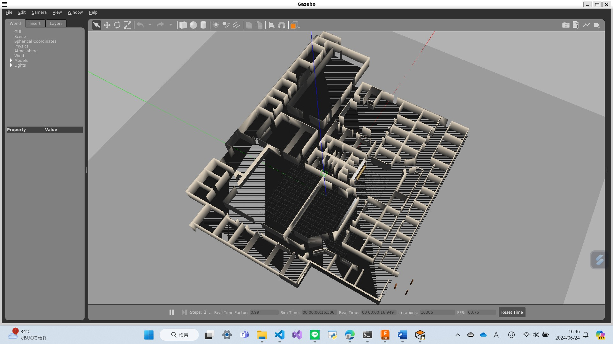
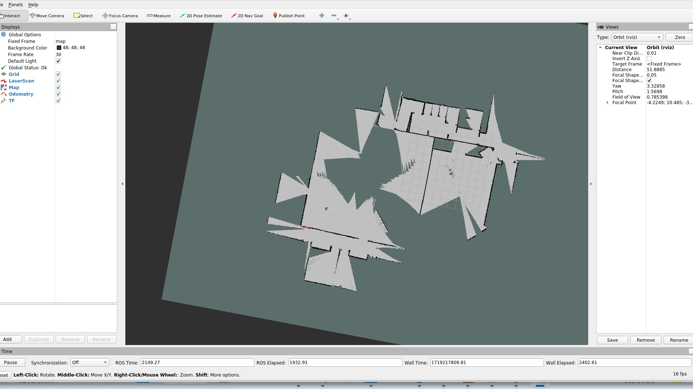
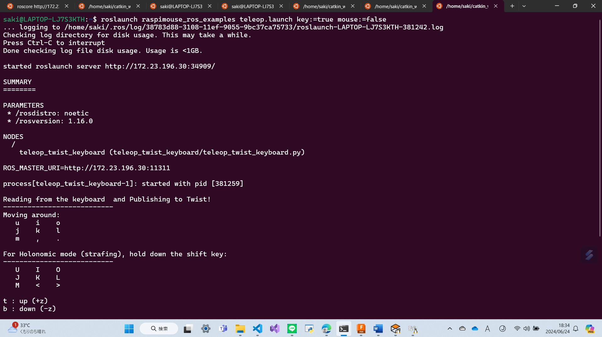
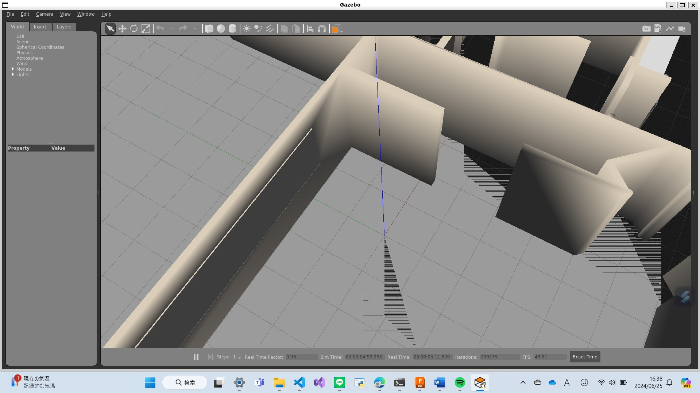

# final_robot
## Title:clarn robot     1100452 仙洞田 咲(SAKI SENDODA)

### Project Goals:
・The goal of this project is to design and build a robot that can automatically clean specific rooms or areas. The robot will efficiently clean while avoiding obstacles.

・A larger goal was to create a robot that could autonomously identify its position in the room and recognize the room's layout, as well as detect locations of dirt. However, due to time constraints, this could not be achieved.

・I aimed to use an existing Gazebo simulation from GitHub and replace the robot within it with one designed using Fusion360 to create an autonomous detection robot.

### System Design:
Provide system diagrams and detailed module descriptions, including the mechanical design of the cleaning robot, sensor layout, ROS package structure, and software flowcharts.

Using Fusion360, we designed the model of the cleaning robot as taught in class.


### Testing Results:
Testing results show that despite our efforts to connect the robot with Gazebo until the last moment, we ultimately could not complete it in time.


### Challenges and Solutions:

We used a Gazebo simulation environment found on the internet.
Converting an existing Gazebo simulation environment to work with our self-made robot was very challenging and time-consuming.

# Installation
Download this ROS package.
```
   cd ~/catkin_ws/src
   git clone https://github.com/rt-net/raspimouse_sim.git

```
I used the Gazebo simulation environment provided by RT Corporation's GitHub repository Raspberry Pi Mouse Simulation Environment as a reference for my project. 

Download the dependent ROS packages.
```
cd ~/catkin_ws/src
git clone https://github.com/ryuichiueda/raspimouse_ros_2.git
git clone https://github.com/rt-net/raspimouse_description.git
rosdep install -r -y -i --from-paths raspimouse*
```


## fusion360

Using Fusion360, we created a robot modeled as a cleaning robot.


## moving with URG
```
roslaunch myrobot_1100452_description gazebo.launch
```


## SLAM
I used the Gazebo simulation environment provided by RT Corporation's GitHub repository this as a reference for my project. 
https://github.com/rt-net/raspimouse_sim/blob/master/README.en.md
```
# 1st terminal
roslaunch raspimouse_gazebo raspimouse_with_willowgarage.launch
```


```
# 2nd terminal
roslaunch raspimouse_ros_examples slam_gmapping.launch
```


```
# 3rd terminal
roslaunch raspimouse_ros_examples teleop.launch key:=true mouse:=false
```


# existing gazebo × myrobot
```
roslaunch finalrobot2_1100452_description final.launch
```

My robot has disappeared .....(´;ω;｀)!

# Steps Taken to Resolve the Issue
## 1. Setting Environment Variables
I ensured that the necessary environment variables for ROS and Gazebo were set correctly. I executed the following commands to source the setup files for ROS and the catkin workspace:

```
source /opt/ros/noetic/setup.bash
source ~/catkin_ws/devel/setup.bash
export GAZEBO_MODEL_PATH=$GAZEBO_MODEL_PATH:~/.gazebo/models
```

## 2. Checking Display Environment
To ensure the display environment was correctly set up, I checked the DISPLAY environment variable:

```
echo $DISPLAY
```

## 3. Removing and Recreating Gazebo Configuration
To reset any potentially corrupted Gazebo configuration files, I removed the ~/.gazebo directory:

```
rm -rf ~/.gazebo
```

## 4. Testing with Sample World
I attempted to launch Gazebo using a built-in sample world to verify that Gazebo itself was functioning correctly:
```
gazebo worlds/empty.world
```

## 5. Checking Gazebo Version
I verified that the correct version of Gazebo was installed by running:
```
gazebo --version
```
The output was Gazebo multi-robot simulator, version 11.11.0, confirming that Gazebo was properly installed.

## 6. Running Gazebo with Verbose Logging
To gather more detailed information about why Gazebo was not displaying anything, I ran Gazebo with the --verbose flag:
```
gazebo --verbose willowgarage.world
```
## 7. Reinstalling Gazebo
To rule out any installation issues, I reinstalled Gazebo by removing it and then installing it again:
```
sudo apt-get remove gazebo11
sudo apt-get autoremove
sudo apt-get install gazebo11
```

## 8. Verifying ROS Master Node
I ensured that the ROS master node was running before attempting to spawn the model:

8-1. Opened a terminal and ran:
```
roscore
```
8-2. In another terminal, I attempted to spawn the model again:
```
rosrun gazebo_ros spawn_model -file /home/saki/catkin_ws/src/finalrobot2_1100452_description/urdf/finalrobot2_1100452.urdf -urdf -model finalrobot2_1100452
```

## 9. Verifying Communication with ROS Master
To ensure that the communication between ROS and Gazebo was functioning correctly, I checked the available ROS topics:
```
rostopic list
```
However, only /rosout and /rosout_agg were displayed, indicating that Gazebo was not correctly communicating with ROS.

## 10. Reviewing and Updating World File
I reviewed the world file to ensure it included the ROS plugin and correct model paths. The world file was structured as follows:
```
<?xml version="1.0" ?>
<sdf version="1.6">
  <world name="default">
    <scene>
      <shadows>0</shadows>
    </scene>
    <include>
      <uri>model://ground_plane</uri>
    </include>
    <include>
      <uri>model://sun</uri>
    </include>
    <!-- ROS plugin addition -->
    <plugin name="gazebo_ros" filename="libgazebo_ros_api_plugin.so">
      <robotNamespace>/</robotNamespace>
    </plugin>
    <include>
      <name>finalrobot2_1100452</name>
      <uri>model://finalrobot2_1100452_description</uri>
    </include>
    <gui fullscreen="0">
      <camera name="user_camera">
        <pose>-0.556842 -0.914575 3.68773 0 1.05964 0.520195</pose>
        <view_controller>orbit</view_controller>
      </camera>
    </gui>
  </world>
</sdf>
```
------------------------------------------------------------------------------------

Despite following these steps, the issue persisted. Further investigation into the Gazebo logs and potential deeper configuration issues might be necessary to fully resolve the problem. The detailed log outputs and additional system information are crucial for a more accurate diagnosis and solution.


# Conclusion
Connecting the robot I created with the existing Gazebo simulation environment was more difficult than expected. Despite spending a significant amount of time on this task, I ultimately couldn't complete it on time, which was very frustrating. Originally, I wanted to finish this part quickly and create a robot that could detect dirt like a vacuum cleaner. Although I couldn't complete this project successfully, I plan to dedicate time during the summer break to finish it. I enjoyed working on this project because it involved many techniques related to my graduation research.

Through this project, I was able to deepen my knowledge of using ROS, Gazebo, and Fusion360. I also feel that my problem-solving skills improved when facing technical challenges. In the future, I want to find more efficient methods to progress my projects faster. I plan to leverage this experience for my graduation research and future career.


# Reference
https://github.com/rt-net/raspimouse_sim/blob/master/README.en.md

https://cir-kit.github.io/blog/2015/02/15/gazebo-using-roslaunch/

https://discourse.ros.org/t/fusion-360-tutorial-for-robotics/27036


